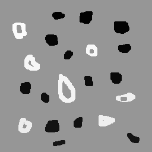
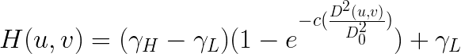
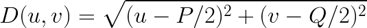
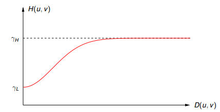
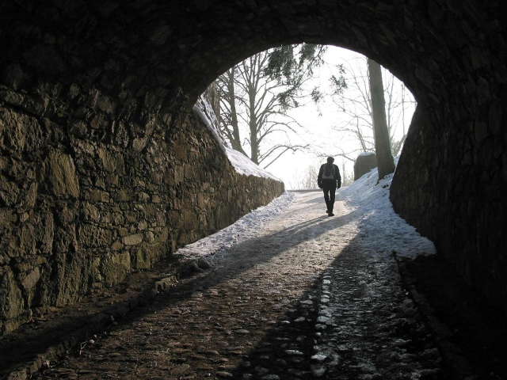
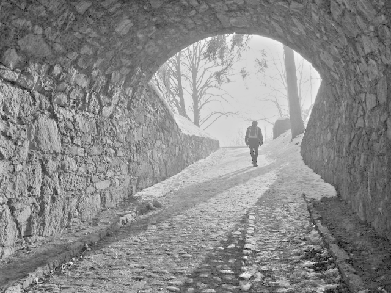
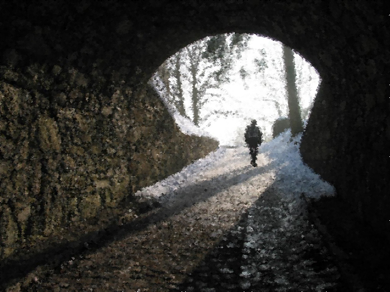
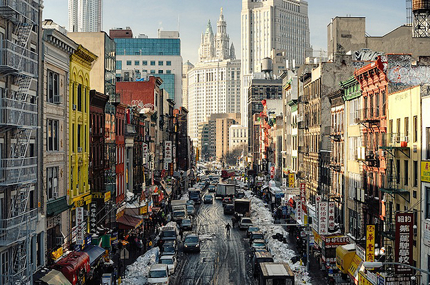

:toc: 
:source-highlighter: pygments

= PROCESSAMENTO DIGITAL DE IMAGENS (DCA0445)
FERNANDO LEANDRO FERNANDES <leandes@gmail.com>;GUSTAVO LINHARES GALVÃO <gustavolinhares1995@gmail.com>

== Apresentação

Esta página é destinada à postagem dos exercícios do tutorial http://agostinhobritojr.github.io/tutoriais/pdi/[Introdução ao processamento digital de imagens com OpenCV], desenvolvido como roteiro para a disciplina de PROCESSAMENTO DIGITAL DE IMAGENS (DCA0445), ministrada pelo Professor Dr. Agostinho Brito Jr., do Departamento de Engenharia de Computação e Automação da Universidade Federal do Rio Grande do Norte - UFRN, no semestre de 2016.2.

Os programas foram implementados em liguagem C++, utilizando a biblioteca OpenCV versão 2.4.13 cuja instalação foi realizada utilizando o tutorial http://pythoneiro.blogspot.com.br/2014/11/instalando-opencv-no-linux-sem-dores-de.html[Instalando OpenCV no Linux sem dores de cabeça]. 

TIP: Optou-se pela ferramenta CMake para a compilação dos códigos.

== 3. Manipulação de pixels de uma imagem

=== Exercício 3.2.a - Negativo de uma região da imagem

O exercício 3.2.a pede para implementar um programa (regions.cpp) que solicite ao usuário as coordenadas de dois pontos P1 e P2 localizados dentro dos limites do tamanho da imagem que lhe for fornecida. A região definida pelo retângulo de vértices opostos definidos pelos pontos P1 e P2 será exibida com o negativo da imagem na região correspondente.

A implementação proposta recebe o nome do arquivo da imagem no parâmetro ''argv[1]'', abre-a, obtém as coordenadas os pontos P1 e P2 e procede à manipulação dos pixels da região delimitada pelos dois pontos informados. Para cada pixel calcula-se o seu inverso, p(x,y) = 255-p(x,y), onde p(x,y) refere-se ao pixel na linha x, coluna y. A listagem abaixo mostra o código que foi implementado.

[[app-listing]]
[source,cpp]
.regions.cpp
----
#include <iostream>
#include <highgui.h>
#include <cv.h>

using namespace std;
using namespace cv;

int main(int argc, char** argv) {

	Mat image;
	Vec3b val;
	int x1, x2, y1, y2, m;

	image= imread(argv[1], CV_LOAD_IMAGE_GRAYSCALE);

	if(!image.data) {
		cout << "Falha ao abrir " << argv[1] << "..." << endl;
		waitKey();
	}

	cout<<"Informe as coordenadas de P1 (x,y): ";
	cin>>x1>>y1;

	cout<<"Informe as coordenadas de P2 (x,y): ";
	cin>>x2>>y2;

	if(x1 > x2) {
		m = x2;
		x2 = x1;
		x1 = m;
	}

	if(y1 > y2) {
		m = y2;
		y2 = y1;
		y1 = m;
	}

	for(int i=x1; i < x2; i++){
		for(int j=y1; j < y2; j++){
			image.at<uchar>(i,j) -= -255;
		}
	}

	namedWindow("window", WINDOW_AUTOSIZE);

	imshow("window", image);

	imwrite("inverted.png", image);

	waitKey(3. );

	return 0;
}
----

Um teste de execução foi realizado com as coordenadas P1 (10, 50) e P2 (150, 80). O resultado pode ser observado na imagem abaixo.

=== Exercício 3.2.b - Trocar regiões da imagem

O exercício 3.2.b pede para implementar um programa (trocaregioes.cpp) que deverá trocar (reposicionar) aleatoriamente regiões da imagem, formando uma espécie de quebra-cabeças.

A implementação realizada obtém o nome do arquivo da imagem do parâmetro ''argv[1]'' fornecido na linha de comando, abre-a, randomiza um percentual da altura e da largura para a realização da separação das regiões. A listagem abaixo mostra o código que foi implementado.

[[app-listing]]
[source,cpp]
.trocaregioes.cpp
----
#include <iostream>
#include <cv.h>
#include <highgui.h>
#include <stdlib.h>
#include <time.h>

using namespace cv;
using namespace std;

int main(int argc, char** argv){

  Mat image;

  int width, height;

  image = imread(argv[1], CV_LOAD_IMAGE_GRAYSCALE);
  if (!image.data) {
    cout << "Falha do abrir " << argv[1] << ", verifique o caminho para o aquivo." << endl;
    waitKey();
  }

  namedWindow("window",WINDOW_AUTOSIZE);

  width=image.size().width;
  cout<<"Largura: " << width << endl;

  height=image.size().height;
  cout<<"Altura: " << height << endl;

  Mat swapimage(height, width, CV_LOAD_IMAGE_GRAYSCALE);

  srand((unsigned) time(NULL));
  int point = rand()%(height < width ? height : width);

  for (int i = 0; i < height; i++) {
    for (int j = 0; j < width; j++) {
      swapimage.at<uchar>(i,j) = image.at<uchar>(((i+point) % height), ((j+point) % width));
    }
  }

  imshow("window", swapimage);

  imwrite("swapped.png",swapimage);

  waitKey();

  return 0;
}
----

Abaixo temos a imagem salva após a troca de regiões.

[[img-swapped]]
.Imagem resultado da troca de regiões

== 4. Preenchendo regiões

=== Exercício 4.2.a - Rotulação com mais de 255 objetos

O exercício 4.2.a pede para que se identifique a situação em que ocorre problemas no processo de rotulação no programa labeling.cpp e apresentar uma solução para o problema de rotulação de mais regiões que a quantidade de valores disponível.

O programa labeling.cpp fornecido rotula cada objeto encontrado com um tom de cinza. Os computadores representam intensidade de brilho em valores que variam entre 0 e 255. Portanto, quando há mais do que 255 elementos a representar, o algoritmo  fica comprometido pela falta de níveis disponíveis para rotulação dos objetos restantes.

A solução proposta é a simples modulação da variável `bubbles`, que conta a quantidade de bolhas, pela quantidade de níveis possíveis, 255. Assim a contagem não é alterada e os valores de nível de cinza são atribuídos sem os problemas antes apresentados. O trecho de código abaixo implementa a solução proposta:

----
   floodFill(image, p, bubbles % 255);
----

=== Exercício 4.2.b - Contagem de bolhas

O exercício 4.2.b pede para que se aprimore o algoritmo de contagem apresentado (labeling.cpp) para identificar regiões com ou sem buracos internos que existam na cena.

A solução proposta é a simples modulação da variável `bubbles`, que conta a quantidade de bolhas, pela quantidade de níveis possíveis, 255. Assim a contagem não é alterada e os valores de nível de cinza são atribuídos sem os problemas antes apresentados. O trecho de código abaixo implementa a solução proposta:

[[app-listing]]
[source,cpp]
.bubblefill.cpp
----
#include <iostream>
#include <opencv2/opencv.hpp>

using namespace cv;
using namespace std;

int main(int argc, char** argv) {

	int ORIGINAL_BGROUND = 0;
	int EXPLORED_BGROUND = 150;

	int ORIGINAL_BUBBLE = 255;
	int EXPLORED_BUBBLE = 152;

	Mat image, mask;
	CvPoint point;

	int width, height;
	int bubbles=0, holes=0;

	image = imread(argv[1], CV_LOAD_IMAGE_GRAYSCALE);

	if(!image.data){
		cout << "Falha ao carregar a imagem " << argv[1] << "." << endl;
		return(-1);
	}

	width = image.size().width;
	height = image.size().height;

	// boder cleaning ----------------------------------------
	int k = 0;
	while (k < height) {

		point.y = k;

		point.x = 0;
		if (image.at<uchar>(point) == ORIGINAL_BUBBLE) {
			floodFill(image, point, ORIGINAL_BGROUND);
		}

		point.x = width-1;
		if (image.at<uchar>(point) == ORIGINAL_BUBBLE) {
			floodFill(image, point, ORIGINAL_BGROUND);
		}

		k++;
	}

	k = 1;
	while (k < width-1) {

		point.x = k;

		point.y = 0;
		if (image.at<uchar>(point) == ORIGINAL_BUBBLE) {
			floodFill(image, point, ORIGINAL_BGROUND);
		}

		point.y = height-1;
		if (image.at<uchar>(point) == ORIGINAL_BUBBLE) {
			floodFill(image, point, ORIGINAL_BGROUND);
		}

		k++;
	}

	// counting bubbles ----------------------------------------

	for(int i = 0; i < height; i++){
		for(int j = 0; j < width; j++){

			if (image.at<uchar>(i,j) == ORIGINAL_BUBBLE){
				bubbles++;
				point.x = j;
				point.y = i;
				floodFill(image, point, bubbles % 100);
			}
		}
	}

	// coloring the background ---------------------------------

	point.x=0;
	point.y=0;
	floodFill(image, point, EXPLORED_BGROUND);

	// counting the holes --------------------------------------

	int previouspix;

	for(int i = 0; i < height; i++){
		for(int j = 0; j < width; j++){

			if (image.at<uchar>(i,j) == ORIGINAL_BGROUND) {

				previouspix = image.at<uchar>(i,j-1);

				if (previouspix < 100) {
					holes++;
					point.x = j-1;
					point.y = i;
					floodFill(image, point, 255-previouspix);
				}

				point.x = j;
				point.y = i;
				floodFill(image, point, EXPLORED_BGROUND);
			}
		}
	}

	cout << "Bolhas solidas: "<< (bubbles - holes) <<"\n";
	cout << "Bolhas vazadas: "<< holes <<"\n";
	
	imshow("image", image);
	
	imwrite("bubblefill.png", image);
	
	waitKey();
	
	return 0;
}
----

Abaixo está mostrada a imagem salva após a contagem de bolhas, no caso, foram encontradas 21 bolhas sendo 7 delas vazadas.

[[img-bubblefill]]
.Imagem após o processamento de contagem de bolhas

== 5. Manipulação de histogramas

=== Exercício 5.2.a - Equalização do histograma

O exercício 5.2.a pede para que se implemente um programa (equalize.cpp) para equalizar o histograma para cada imagem capturada do vídeo de uma câmera que está conectada ao computador. É mostrado assim, duas janelas, sendo uma com imagens originais, e outra com as imagens contendo seu histograma já equalizado. As imagens são processadas em tons de cinza. A seguir está o código para esse programa, equalize.cpp.

[[app-listing]]
[source,cpp]
.equalize.cpp
----
#include <iostream>
#include <opencv2/opencv.hpp>

using namespace cv;
using namespace std;

int main(int argc, char** argv){
  Mat image;
  int width, height;
  VideoCapture cap;

  Mat histGray, histEqualized;
  Mat imageEqualized;

  int nbins = 64;
  float range[] = {0, 256};
  const float *histrange = { range };
  bool uniform = true;
  bool acummulate = false;

  cap.open(0);

  if(!cap.isOpened()){
    cout << "cameras indisponiveis";
    return -1;
  }

  width  = cap.get(CV_CAP_PROP_FRAME_WIDTH);
  height = cap.get(CV_CAP_PROP_FRAME_HEIGHT);

  cout << "largura = " << width << endl;
  cout << "altura  = " << height << endl;

  int histw = nbins, histh = nbins/2;

  Mat histImgGray(histh, histw,  CV_BGR2GRAY, Scalar(0,0,0));
  Mat histImgEqualized(histh, histw,  CV_BGR2GRAY, Scalar(0,0,0));

  while(1){
    cap >> image;

    cvtColor(image, image, CV_BGR2GRAY);

    calcHist(&image, 1, 0, Mat(), histGray, 1,
             &nbins, &histrange,
             uniform, acummulate);

    normalize(histGray, histGray, 0, histImgGray.rows, NORM_MINMAX, -1, Mat());

    histImgGray.setTo(Scalar(0));

    equalizeHist(image, imageEqualized);

    calcHist(&imageEqualized, 1, 0, Mat(), histEqualized, 1,
             &nbins, &histrange,
             uniform, acummulate);

    normalize(histEqualized, histEqualized, 0, histImgEqualized.rows, NORM_MINMAX, -1, Mat());

    histImgEqualized.setTo(Scalar(0));

     for(int i=0; i<nbins; i++){
      line(histImgGray, Point(i, histh),
           Point(i, cvRound(histGray.at<float>(i))),
           Scalar(255), 1, 8, 0);

      line(histImgEqualized, Point(i, histh),
           Point(i, cvRound(histEqualized.at<float>(i))),
           Scalar(255), 1, 8, 0);
      }

    histImgGray.copyTo(image(Rect(0, 0,nbins, histh)));

    histImgEqualized.copyTo(imageEqualized(Rect(0, 0,nbins, histh)));

    imshow("image", image);
    imshow("imageEqualized", imageEqualized);

    if(waitKey(30) >= 0) break;
  }
  return 0;
}
----

Cada pixel de uma imagem tem uma cor que foi produzida por uma combinação de cores primárias (vermelho, verde e azul, ou RGB). Cada uma dessas cores pode ter um brilho que varia de 0 a 255 em uma imagem digital com profundidade de bits de 8-bits. Um histograma RGB é produzido quando o computador varre a imagem em cada um desses valores de brilho RGB e conta quantos pixels há em cada nível de 0 a 255. Como o trabalho foi realizado com imagens processadas em tons de cinza, o histograma é apresentado de acordo com os níveis de cinza. Com o histograma calculado, é feito sua equalização.

Equalizar o histograma significa obter a máxima variância do histograma de uma imagem, obtendo assim uma imagem com o melhor contraste. O contraste é uma medida qualitativa e que está relacionada com a distribuição dos tons de cinza em uma imagem.

Para calcular o histograma foi utilizado a função calcHist. Foi calculado primeiramente o histograma para o vídeo contendo imagens originais. A variável que contém a matriz com as imagens originais se chama image, do tipo Mat. A variável que contém o histograma para as imagens originais se chama histGray, do tipo Mat. No algorítmo apresentado, a linha que corresponde ao que foi explicado anteriormente é a seguinte:

----
	calcHist(&image, 1, 0, Mat(), histGray, 1, &nbins, &histrange, uniform, acummulate);
----

Já tendo em posse o histograma calculado, para realizar a equalização deste histograma foi utilizado a função equalizeHist. O primeiro parâmetro dessa função trata-se de uma variável do tipo Mat. Essa variável contém a matriz da imagem a ser equalizada. Já o segundo parâmetro trata-se do resultado, isto é, a imagem equalizada. No algorítmo apresentado, a linha que corresponde ao que foi explicado anteriormente é a seguinte:

----
	equalizeHist(image, imageEqualized);
----

Após a equalização, é calculado o seu histograma:

----
	calcHist(&imageEqualized, 1, 0, Mat(), histEqualized, 1, &nbins, &histrange, uniform, acummulate);
----

A variável histEqualized é do tipo Mat. Ela contém o histograma da imagem já equalizada.

Com a imagem equalizada e seu histograma calculado, é mostrado duas janelas para comparação. Uma janela com o nome image, que trata-se do vídeo original, e a outra janela com o nome imageEqualized, que trata-se do vídeo com as imagens equalizadas. As imagens são mostradas através da função imshow().

----
	imshow("image", image);
	imshow("imageEqualized", imageEqualized);
----

Abaixo temos as imagens original e equalizada, resultado do processamento.

[[image-equalized]]
.Imagem original e equalizada, após o processamento.
image::images/imageEqualize1.png[Imagem equalizada]

No canto superior esquerdo é mostrado o histograma da imagem. É possível perceber que a imagem equalizada apresenta um maior contraste.

=== Exercício 5.2.b - Detecção de movimento

O exercício 5.2.b pede para que se implemente um programa (`motiondetector.cpp`) para detectar movimento através de uma câmera conectada ao computador. Este algoritmo funciona comparando o histograma da imagem capturada com o último histograma calculado. Se a diferença ultrapassar um limiar pré-estabelecido, um alarme é ativado. A seguir está o código para esse programa.

[[app-listing]]
[source,cpp]
.motiondetector.cpp
----
#include <iostream>
#include <opencv2/opencv.hpp>

using namespace cv;
using namespace std;

const string currentDateTime() {
    time_t now = time(0);
    struct tm  tstruct;
    char buf[80];
    tstruct = *localtime(&now);
    strftime(buf, sizeof(buf), "%Y-%m-%d.%X", &tstruct);

    return buf;
}

int main(int argc, char** argv){
  Mat image;
  int width, height;
  VideoCapture cap;
  vector<Mat> planes;
  Mat histB;
  int nbins = 64;
  float range[] = {0, 256};
  const float *histrange = { range };
  bool uniform = true;
  bool acummulate = false;

  Mat lastHist;
  double aux=0;

  cap.open(0);

  if(!cap.isOpened()){
    cout << "cameras indisponiveis";
    return -1;
  }

  width  = cap.get(CV_CAP_PROP_FRAME_WIDTH);
  height = cap.get(CV_CAP_PROP_FRAME_HEIGHT);

  cout << "largura = " << width << endl;
  cout << "altura  = " << height << endl;

  int histw = nbins, histh = nbins/2;
  Mat histImgR(histh, histw, CV_8UC3, Scalar(0,0,0));

  cap >> image;
  split (image, planes);
  calcHist(&planes[0], 1, 0, Mat(), lastHist, 1,
           &nbins, &histrange,
           uniform, acummulate);

  while(1){
    cap >> image;
    split (image, planes);
    calcHist(&planes[0], 1, 0, Mat(), histB, 1,
             &nbins, &histrange,
             uniform, acummulate);

    normalize(histB, histB, 0, histImgR.rows, NORM_MINMAX, -1, Mat());

    histImgR.setTo(Scalar(0));

    for(int i=0; i<nbins; i++){
      line(histImgR, Point(i, histh),
           Point(i, cvRound(histB.at<float>(i))),
           Scalar(255, 0, 0), 1, 8, 0);
    }

    double compare = compareHist(histB, lastHist, CV_COMP_INTERSECT);

    //CV_COMP_INTERSECT
    if(compare>(aux+34) || compare<(aux-34)){

      cout << "Movimento detectado: " << currentDateTime() << std::endl;
      cout<<endl;
    }

    histImgR.copyTo(image(Rect(0, 0,nbins, histh)));

    imshow("image", image);
    if(waitKey(30) >= 0) break;

    lastHist=histB;
    aux=compare;
  }
  return 0;
}
----

Esse programa foi feito o calculando primeiramente o histograma para a primeira imagem capturada e salvando-o na variável chamada lastHist, do tipo Mat.

----
	calcHist(&planes[0], 1, 0, Mat(), lastHist, 1, &nbins, &histrange, uniform, acummulate);
----

A seguir, em um loop infinito, é calculado o histograma da imagem capturada atual, salvando-o na variável histB, do tipo Mat.

----
	calcHist(&planes[0], 1, 0, Mat(), histB, 1, &nbins, &histrange, uniform, acummulate);
----

É criado uma variável do tipo double chamada compare. Essa variável recebe o valor que a função compareHist retorna. A função compareHist serve para comparar dois histogramas. No caso do algoritmo em questão, compara o histB com lastHist.

----
	double compare = compareHist(histB, lastHist, CV_COMP_INTERSECT);
----

A variável compare será calculada continuamente, para cada iteração do loop, sempre calculando a diferença entre o histograma atual e o histograma anterior. A variável aux serve para salvar o último valor da variável compare. Se a diferença entre compare e aux for maior que 34 ou menor que -34, é detectado o movimento e é salvado o dia e a hora do ocorrido.

----
	if(compare>(aux+34) || compare<(aux-34)){
		cout << "Movimento detectado: " << currentDateTime() << std::endl;
		cout<<endl;
	}
----

A função currentDateTime() serve para imprimir o dia e a hora atual.

----
	const string currentDateTime() {
	    time_t now = time(0);
	    struct tm  tstruct;
	    char buf[80];
	    tstruct = *localtime(&now);
	    strftime(buf, sizeof(buf), "%Y-%m-%d.%X", &tstruct);

	    return buf;
}
----

A variável lastHist, no final da iteração, recebe o valor de histB, e aux recebe o valor de compare, para assim, ao começar outra iteração, essas variáveis estarem com o valor anterior das respectivas variáveis.

----
	lastHist=histB;
	aux=compare;
----

A saída é mostrada a seguir:

[[image-motion1]]
.Movimento detectado, teste 1.

[[image-motion2]]
.Movimento detectado, teste 2.
image::images/motion2.png[Motion 2]

Ao movimentar a mão, o programa detecta o movimento e salva o dia e a hora do evento.

== 6. Filtragem no domínio espacial I

=== Exercício 6.2.a - Filtro laplaciano do gaussiano

O exercício 6.2.a pede para que, utilizando o programa exemplos/filtroespacial.cpp como referência, implemente um programa laplgauss.cpp que deverá acrescentar mais uma funcionalidade ao exemplo fornecido, permitindo que seja calculado o laplaciano do gaussiano das imagens capturadas. Ao fim, comparar o resultado desse filtro com a simples aplicação do filtro laplaciano.

[[app-listing]]
[source,cpp]
.laplgauss.cpp
----
#include <cstdio>
#include <iostream>
#include <opencv2/opencv.hpp>

using namespace cv;
using namespace std;

void printmask(Mat &m){
	
	cout << "\nMascara atual\n";
	
	for(int i=0; i<m.size().height; i++){
		cout << "|\t";
		for(int j=0; j<m.size().width; j++){
			printf("%.2f\t", m.at<float>(i,j));
		}
		cout << "|\n";
	}

	cout << endl;
}

void print_menu(){

	cout << 
	    "\nPressione a tecla correspondente ao filtro desejado: \n"
		"c/C - Ativar/desativar modo modular\n"
		"m/M - Filtro mediano\n"
		"g/G - Filtro gaussano\n"
		"v/V - Filtro vertical\n"
		"h/H - Filtro horizontal\n"
		"l/L - Filtro laplaciano\n"
		"q/Q - Filtro laplaciano do gaussiano\n"
		"[ESC] - Sair\n\n";
}

int main(int argvc, char** argv){
	
	char const ESC_KEY = 27;

	VideoCapture video;

	video.open(0);

	if (!video.isOpened()) {
		return -1;
	}
	
	float average[] =	{
						1, 1, 1,
						1, 1, 1,
						1, 1, 1
						};
	Mat average_mask = Mat(3, 3, CV_32F, average);
	average_mask = average_mask * (1/9.0);

	float gauss[] = {
					1, 2, 1,
					2, 4, 2,
					1, 2, 1
					};
	Mat gauss_mask = Mat(3, 3, CV_32F, gauss);
	gauss_mask = gauss_mask * (1/16.0);

	float horizontal[] = {
						 -1, 0, 1,
						 -2, 0, 2,
						 -1, 0, 1
						 };
	Mat horizontal_mask = Mat(3, 3, CV_32F, horizontal);

	float vertical[] =	{
						-1,-2,-1,
						 0, 0, 0,
						 1, 2, 1
						};
	Mat vertical_mask = Mat(3, 3, CV_32F, vertical);

	float laplacian[]=	{
						 0,-1, 0,
						-1, 4,-1,
						 0,-1, 0,
						};
	Mat laplacian_mask = Mat(3, 3, CV_32F, laplacian);

	Mat mask = average_mask;

	Mat capture, frame, frame32f, frameFiltered, result;
	int absolut_mode = true;
	int additional_laplacian_step = false;
	int key;

	double width, height;
	width  = video.get(CV_CAP_PROP_FRAME_WIDTH);
	height = video.get(CV_CAP_PROP_FRAME_HEIGHT);
	cout << "largura=" << width << "\n";;
	cout << "altura =" << height<< "\n";;

	namedWindow("filtroespacial",1);

	print_menu();

	while (key != ESC_KEY) {
			
		video >> capture;

		// Manipulacoes do frame capturado
		cvtColor(capture, frame, CV_BGR2GRAY);
		flip(frame, frame, 1);
		imshow("original", frame);

		frame.convertTo(frame32f, CV_32F);

		// Aplica o filtro espacial selecionado (mask)		
		filter2D(frame32f, frameFiltered, frame32f.depth(), mask, Point(1,1), 0);
		
		if (additional_laplacian_step) {
			filter2D( frameFiltered, frameFiltered, frame32f.depth(), laplacian_mask, Point(1,1), 0);
		}

		if (absolut_mode) {
			frameFiltered = abs(frameFiltered);
		}

		frameFiltered.convertTo(result, CV_8U);
		
		imshow("filtroespacial", result);
		
		key = waitKey(10);

		if (key == 'c' || key == 'C' ||
			key == 'm' || key == 'M' ||
			key == 'g' || key == 'G' || 
			key == 'q' || key == 'Q' ||
			key == 'h' || key == 'H' ||
			key == 'v' || key == 'V' ||
			key == 'l' || key == 'L') {

			print_menu();

			if (key == 'c' || key == 'C') {
				absolut_mode = !absolut_mode;
				cout << "Modo absoluto " << (absolut_mode ? "ativado" : "desativado") << endl;

			} else if (key == 'm' || key == 'M') {
				mask = average_mask;
				additional_laplacian_step = false;
				cout << "Filtro da media ativado." << endl;

			} else if (key == 'g' || key == 'G') {
				mask = gauss_mask;
				additional_laplacian_step = false;
				cout << "Filtro gaussiano ativado." << endl;

			} else if (key == 'h' || key == 'H') {
				mask = horizontal_mask;
				additional_laplacian_step = false;
				cout << "Filtro da horizontal ativado." << endl;

			} else if (key == 'v' || key == 'V') {
				mask = vertical_mask;
				additional_laplacian_step = false;
				cout << "Filtro da vertical ativado." << endl;

			} else if (key == 'l' || key == 'L') {
				mask = laplacian_mask;
				additional_laplacian_step = false;
				cout << "Filtro da laplaciano ativado." << endl;

			} else if (key == 'q' || key == 'Q') {
				mask = gauss_mask;
				additional_laplacian_step = true;
				cout << "Filtro laplaciano do gaussiano ativado." << endl;

			}

			printmask(mask);
		}
	}
	return 0;
}
----

Abaixo as imagens produzidas com o processamento da imagem original. Destacamos que a opção de valores absolutos não surte efeito quando estão ativos os filtros da média ou gaussiano.

[[img-original]]
.Imagem original
image::images/original.png[Original]

[[img-gauss]]
.Imagem com filto gaussiano

[[img-media]]
.Imagem com filtro da média

[[img-vertical]]
.Imagem com filtro vertical
image::images/vertical.png[Vertical]

[[img-vertical-abs]]
.Imagem com filtro vertical (absoluto)

[[img-horizontal]]
.Imagem com filtro horizontal
image::images/horizontal.png[Horizontal]

[[img-horizontal-abs]]
.Imagem com filtro horizontal (absoluto)
image::images/horizontal-abs.png[Horizontal absoluto]

[[img-laplaciano]]
.Imagem com filtro laplaciano

[[img-laplaciano-abs]]
.Imagem com filtro laplaciano (absoluto)

[[img-laplacianogaussiano]]
.Imagem com filtro laplaciano do gaussiano

[[img-laplacianogaussiano-abs]]
.Imagem com filtro horizontal (absoluto)
image::images/gaussian-laplacian-abs.png[Laplaciano-Gaussiano absoluto]

== 7. Filtragem no domínio espacial II

=== Exercício 7.2.a - Efeito tiltshift estático

O exercício 7.2.a pede para que, tomando como base o programa http://agostinhobritojr.github.io/tutoriais/pdi/exemplos/addweighted.cpp[addweighted.cpp], seja implementado um programa que simule o efeito de lentes tiltshift em imagens estáticas.  Três ajustes devem ser providos na tela da interface:

- um ajuste para regular a altura da região central que entrará em foco;

- um ajuste para regular a força de decaimento da região borrada;

- um ajuste para regular a posição vertical do centro da região que entrará em foco. 

Finalizado o programa, a imagem produzida deverá ser salva em arquivo.

[[app-listing]]
[source,cpp]
.tiltshift.cpp
----
----

=== Exercício 7.2.b - Efeito tiltshift dinâmico

O exercício 7.2.b pede para que seja implementado um programa que simule o efeito de lentes tiltshift em video. Os mesmos outros requisitos do exercício anterior se aplicam.

[[app-listing]]
[source,cpp]
.tiltshiftvideo.cpp
----
----

== 8. Filtragem no domínio da frequência

=== Exercício 8.2 - Filtragem homomófica

O exercício 8.2 pede para que se implemente um filtro homomórfico para melhorar imagens com iluminação irregular. A entrada do programa é uma imagem mal iluminada, e a saída é uma imagem com o filtro homomórfico aplicado e, como esperado, iluminação corrigida.

O filtro homomórfico atenua as frequências baixas, caracterísitica da iluminação e aplica um ganho às frequências altas. Para isso, é necessário separar a iluminância da reflectância. Essa filtragem se realiza, suscintamente, calculado o logarítmo da imagem, para assim, aplicar a Transformada Discreta de Fourier (Discrete Fourier Transform _ DFT) para, então, aplicar a filtragem homomórfica.

A função de transferência do filtro homomórfico é dada pela seguinte expressão:

[[img-fnHuv]]

onde, Gama_H é o limite superior da atenuação do filtro e Gama_L é o limite inferior. D0 é frequência de corte (__cutoff__) do filtro e D(u,v) é dado pela fórmula:

[[img-fnDuv]]

em que P e Q são as dimensões ajustadas (__padded__) da imagem.

O gráfico da função de transferência do filtro homomórfico se assemelha ao mostrado no gráfico abaixo:

[[img-graphHomomorphic]]
.Gráfico da função de transferência do filtro homomórfico.

Após a aplicação do filtro, calculou-se a Transformada Discreta Inversa de Fourier (Inverse Discrete Fourier Transform - IDFT), normalizou-se os pontos da imagem para valores de 0 a 1. 

Para retormar a imagem da escala logarítmica calculou-se a exponencial da imagem e, novamente, a normalizou. Os resultados obtidos foram os seguintes:

[[app-listing]]
[source,cpp]
.dft.cpp
----
#include <stdio.h>
#include <stdlib.h>
#include <sys/types.h>
#include <unistd.h>
#include <opencv2/opencv.hpp>
#include <opencv2/highgui/highgui.hpp>
#include <iostream>

using namespace std;
using namespace cv;

// FILTER PARAMETERS
int gainSlider = 5;
int radiusSlider = 80;
int gammaLowSlider = 5;
int gammaHighSlider = 20;

// FILTER LIMITS
int MAX_GAIN = 1000;
int MAX_RADIUS = 1000;
int MAX_GAMMA_LOW = 1000;
int MAX_GAMMA_HIGH = 1000;

char trackbar[50];

vector<Mat> complexComponents;
Mat loadedImage, complexImage, filter;
Mat_<float> realComponent, imaginaryComponent;

int originalWidth, originalHeight;
int optimalWidth,  optimalHeight;

void swapQuadrants(Mat& image) {

  Mat buffer, A, B, C, D;

  // se a imagem tiver tamanho impar, recorta a regiao 
  // para evitar cópias de tamanho desigual
  // image = image(Rect(0, 0, image.cols & -2, image.rows & -2));
  int cx = image.cols / 2;
  int cy = image.rows / 2;

  int ox = image.cols - cx;
  int oy = image.rows - cy;

  // reorganiza os quadrantes da transformada
  // A B   -> D C
  // C D    B A
  A = image(Rect(0, 0, cx, cy));
  B = image(Rect(cx, 0, ox, cy));
  C = image(Rect(0, cy, cx, oy));
  D = image(Rect(cx, cy, ox, oy));

  // A <-> D
  A.copyTo(buffer);
  D.copyTo(A);
  buffer.copyTo(D);

  // C <-> B
  C.copyTo(buffer);
  B.copyTo(C);
  buffer.copyTo(B);
}

void makeBorder(
    Mat& image, 
    Mat& bordedImage, 
    int& actualHeight, 
    int& actualWidth, 
    int& optimalHeight, 
    int& optimalWidth) {

  // obtem os tamanhos otimos para calculo do FFT
  optimalHeight = getOptimalDFTSize(image.rows);
  optimalWidth  = getOptimalDFTSize(image.cols);

  // realiza o padding da imagem
  cv::copyMakeBorder( image, bordedImage, 0,
            optimalHeight - actualHeight, 0,
            optimalWidth - actualWidth,
            BORDER_CONSTANT, Scalar::all(0));

  // prepara a matriz complexa para ser preenchida
  complexImage = Mat(image.size(), CV_32FC2, Scalar(0));

  // parte imaginaria da matriz complexa (preenchida com imag)
  imaginaryComponent = Mat_<float>::zeros(bordedImage.size());
}

Mat& toComplex(Mat& image) {

  // cria a compoente real em escala logaritmica
  realComponent = Mat(image);
  realComponent += Scalar::all(1);
  cv::log(realComponent, realComponent);

  // limpa o array de matrizes que vao compor a imagem complexa
  complexComponents.clear();

  // insere as duas componentes no array de matrizes
  complexComponents.push_back(realComponent);

  complexComponents.push_back(imaginaryComponent);

  // combina o array de matrizes em uma unica componente complexa
  cv::merge(complexComponents, complexImage);

  return complexImage;
}

void buildFilter(Mat& filter, int optimalHeight, int optimalWidth) {

  // Cria uma matriz temporária para criar as 
  // componentes real e imaginaria do filtro ideal
  Mat_<float> mask = Mat(optimalHeight, optimalWidth, CV_32F);

  float H, W;
  float gain = (float) gainSlider/10;
  float gammaLow = (float) gammaLowSlider/10;
  float gammaHigh = (float) gammaHighSlider/10;
  float radius = (float) radiusSlider/10;

  printf("\nGanho(c)/Gama(L)/Gama(H)/Raio: %.3f/ %.3f/ %.3f/ %.3f", gain, gammaLow, gammaHigh, radius);

  for (int h = 0; h < optimalHeight; h++) {
    for (int w = 0; w < optimalWidth; w++) {
      H = h - ((float) optimalHeight / 2);
      W = w - ((float) optimalWidth / 2);
      mask.at<float>(h,w) = ((gammaHigh - gammaLow) * (1 - exp(-gain * ((H*H)+(W*W))/(radius*radius)))) + gammaLow;
    }
  }

  cv::imshow("Filtro homomorfico", mask);

  Mat masks[] = {mask, mask};
  cv::merge(masks, 2, filter);
}

Mat& homomorphic(Mat& complexImage, Mat& filter) {

  // Calcula a DFT
  cv::dft(complexImage, complexImage);

  // realiza a troca de quadrantes
  swapQuadrants(complexImage);

  // aplica o filtro frequencial
  cv::mulSpectrums(complexImage, filter, complexImage, 0);

  // permuta os quadrantes
  swapQuadrants(complexImage);

  // calcula a TRANSFORMADA INVERSA DE FOURIER
  cv::idft(complexImage, complexImage);

  complexComponents.clear();

  // separa os componentes da imagem complexa
  cv::split(complexImage, complexComponents);

  // normaliza os valores dos pixels entre 0 e 1
  cv::normalize(complexComponents[0], complexComponents[0], 0, 1, CV_MINMAX);

  // aplica o exponencial ao componente real da imagem
  cv::exp(complexComponents[0], complexComponents[0]);

  // normaliza novamente os valores dos pixels entre 0 e 1
  cv::normalize(complexComponents[0], complexComponents[0], 0, 1, CV_MINMAX);

  return complexComponents[0];
}

void loadImage(Mat& originalImage, Mat& loadedImage, Mat& filter) {

  cv::imshow("original", originalImage);

  originalWidth = originalImage.cols;
  originalHeight= originalImage.rows;

  makeBorder(
    originalImage, 
    loadedImage, 
    originalHeight, 
    originalWidth, 
    optimalHeight, 
    optimalWidth);

  buildFilter(
    filter, 
    optimalHeight, 
    optimalWidth);
}

void processSlider(int, void*) {
  
  buildFilter(filter, optimalHeight, optimalWidth);
}

int main(int argc, char** argv) {

  char key = 0;
  Mat homomorphicImage;
  Mat inputImage = cv::imread(argv[1], CV_LOAD_IMAGE_GRAYSCALE);

  loadImage(inputImage, loadedImage, filter);

  do {

    homomorphicImage = homomorphic(toComplex(loadedImage), filter);
    cv::imshow("Filtragem homomorfica", homomorphicImage);

    sprintf( trackbar, "Gama (H) x %d", MAX_GAMMA_HIGH/10);
    cv::createTrackbar( trackbar, "Filtragem homomorfica", 
              &gammaHighSlider, 
              MAX_GAMMA_HIGH, 
              NULL);
    
    sprintf( trackbar, "Gama (L) x %d", MAX_GAMMA_LOW/10);
    cv::createTrackbar( trackbar, "Filtragem homomorfica", 
              &gammaLowSlider, 
              MAX_GAMMA_LOW, 
              NULL);
    
    sprintf( trackbar, "K x %d", MAX_GAIN/10);
    cv::createTrackbar( trackbar, "Filtragem homomorfica", 
              &gainSlider, 
              MAX_GAIN, 
              NULL);

    sprintf( trackbar, "Raio x %d", MAX_RADIUS/10);
    cv::createTrackbar( trackbar, "Filtragem homomorfica", 
              &radiusSlider, 
              MAX_RADIUS, 
              NULL);

    processSlider(radiusSlider,0);

  } while ((char)waitKey(10) != 27);

  // cv::imwrite("homomorfica.jpg", homomorphicImage);

  return 0;
}
----

[[image-tunel-shades]]
.Imagem original usada na filtragem homomórfica.

[[image-NYC-points]]
.Imagem obtida após a filtragem homomórfica.

É possível ajustar 4 parâmetros do filtro para adequar às necessidades de correção da imagem tratada, são eles o c (ganho), o gama low (gL), gama high (gH) e o raio ou frequência de corte do filtro (D0), em inglês __cutoff__.

Para a imagem acima, foram utilizados os seguintes parâmetros: Ganho(c): 0.5, Gama-low (gL): 0.5, Gama-high(gH): 0.8, Raio (D0): 8.
O resultado obtido atende ao esperado, corrigindo a iluminação deficiente da imagem original.

== 10. Canny e a arte com pontilhismo

=== Exercício 10 - Filtragem homomófica

O exercício 10 pede para que, utilizando programas de exemplo (''canny.cpp'' e ''pontilhismo.cpp'') como referência, fosse implementado o programa ''cannypoints.cpp'' que simule a técnica de pintura artística conhecida como pontilhismo que as imagens são compostas com pontos utilizando as bordas produzidas pelo algoritmo de Canny para melhorar a qualidade da imagem pontilhista gerada. Ao fim, descrever detalhes do procedimento usado para criar sua técnica pontilhista.

A implementação desenvolvida para a resolução do problema proposto foi o seguinte:

[[app-listing]]
[source,cpp]
.cannypoints.cpp
----
#include <iostream>
#include <opencv2/opencv.hpp>

#include <fstream>
#include <iomanip>
#include <vector>
#include <algorithm>
#include <numeric>
#include <ctime>
#include <cstdlib>

#include <list>
#include <random>

#include <ext/numeric>
#include <ext/algorithm>
#include <ext/functional>

using namespace std;
using namespace cv;

int threshld = 10;
int THRESHOLD_MAX = 200;

//STEP define o passo usado para varrer a imagem de referência
int step = 1;
int STEP_MAX = 8;

int jitter = 2;
int JITTER_MAX = 15;

int radius = 1;
int RADIUS_MAX = 8;

Mat cannyPoints;
Mat image, border;

void processCannyParameters(int, void*) {

  int x, y;
  int width  = image.size().width;
  int height = image.size().height;

  // Determina os contornos usando os algorirmo de Canny
  Canny(image, border, threshld, 3 * threshld);
  
  imshow("canny", border);

  // Limita o STEP e o JITTER a 1.
  step = (step < 1 ? 1 : step);
  jitter = (jitter < 1 ? 1 : jitter);

  // calcula parametros fixos para otimizar a execucao
  float halfSTEP = (step/2);
  int oneJITTER = (jitter + 1);
  int doubleJITTER = (2*jitter);

  // Inicializa o vetor xrange com um ganho igual 
  // ... a STEP e um deslocamento STEP/2
  vector<int> xrange;
  xrange.resize(height/step);
  for (uint i = 0; i < xrange.size(); i++) {
    xrange[i] = (i * step) + halfSTEP;
  }

  // Inicializa o vetor xrange com um ganho igual 
  // ... a STEP e um deslocamento STEP/2
  vector<int> yrange;
  yrange.resize(width/step);
  for (uint i = 0; i < yrange.size(); i++) {
    yrange[i] = (i * step) + halfSTEP;
  }

  cannyPoints = Mat(height, width, CV_8UC3, Scalar(255, 255, 255));

  // randomizacao dos elementos do range em X
  random_shuffle(xrange.begin(), xrange.end());

  for (auto i : xrange) {

    // randomizacao dos elementos do range em Y
    random_shuffle(yrange.begin(), yrange.end());

    for (auto j : yrange) {

      // Obtem, para cada elemento (i,j) 
      // ... sorteado, o ponto (x,y) da imagem.
      x = (i + (rand() % doubleJITTER) - oneJITTER);
      y = (j + (rand() % doubleJITTER) - oneJITTER); 

      // Desenha um circulo de raio RAIO da mesma cor do ponto (x,y) 
      // ... da imagem. Observe o 'swap' dos valores BGR para RGB
      circle( cannyPoints, 
          cv::Point(y, x), 
          radius, 
          CV_RGB(
            // Obtem a cor do ponto (x,y) da imagem.
            (int)(image.at<Vec3b>(x,y)[2]), 
            (int)(image.at<Vec3b>(x,y)[1]), 
            (int)(image.at<Vec3b>(x,y)[0])), 
          -1, 
          CV_AA);
    }
  }

  // Desenho dos pontos da borda da imagem para 
  // ... realce das bordas da imagem pontilhista gerada
  for (int i = 0; i < height; i+=2 ) {

    for (int j = 0; j < width; j+=2) {

      if (border.at<uchar>(i, j) > 0) {

        circle( cannyPoints, 
            cv::Point(j,i), 
            radius/2, 
            CV_RGB(
              (int)(image.at<Vec3b>(i,j)[2]), 
              (int)(image.at<Vec3b>(i,j)[1]), 
              (int)(image.at<Vec3b>(i,j)[0])), 
            -1, 
            CV_AA);
      }
    }
  }

  imshow("Canny", cannyPoints);
}

int main(int argc, char**argv) {

  image = imread(argv[1], CV_LOAD_IMAGE_COLOR);

  namedWindow("Canny", 1);

  cvMoveWindow( "Canny", image.cols, 0 );

  createTrackbar("LIMIAR", "Canny", 
          &threshld, 
          THRESHOLD_MAX, 
          processCannyParameters);

  createTrackbar("PASSO", "Canny", 
          &step, 
          STEP_MAX, 
          processCannyParameters);

  createTrackbar("JITTER", "Canny", 
          &jitter, 
          JITTER_MAX, 
          processCannyParameters);

  createTrackbar("RAIO", "Canny", 
          &radius, 
          RADIUS_MAX, 
          processCannyParameters);

  processCannyParameters(threshld, 0 );

  imwrite("canny.jpg", cannyPoints);

  do {} while ((char)waitKey(10) != 27);

  return 0;
}
----

Abaixo temos as imagens original e processada, resultado do processamento com a técnica pontilhista desenvolvida.

TIP: Foram usados os seguintes parâmetros no processamento das imagens: Limiar=8, Passo=1, Jitter=2, Raio=2.

[[image-tunnel]]
.Imagem original de um túnel usada na técnica de pontilhismo antes do processamento.

[[image-tunnel-points]]
.Imagem do túnel obtida da técnica de pontilhismo.

Observou-se que 'pontos' gerados com círculos de raio muito grande geravam uma marcação artificial dos contornos da imagem. Assim, optou-se por reduzir o raio dos círculos pela metade assim como a frequência dos pontos desenhados, também pela metade.

[[image-NYC]]
.Imagem original da cidade de Nova York usada na técnica de pontilhismo antes do processamento.

[[image-NYC-points]]
.Imagem da cidade de Nova York obtida da técnica de pontilhismo.

Ressaltamos a característica de semelhança com uma pintura aplicando a técnica simulada sem, entretanto sobrecarregar com pontilhado as bordas da imagem e mantendo a similaridade desejada. 